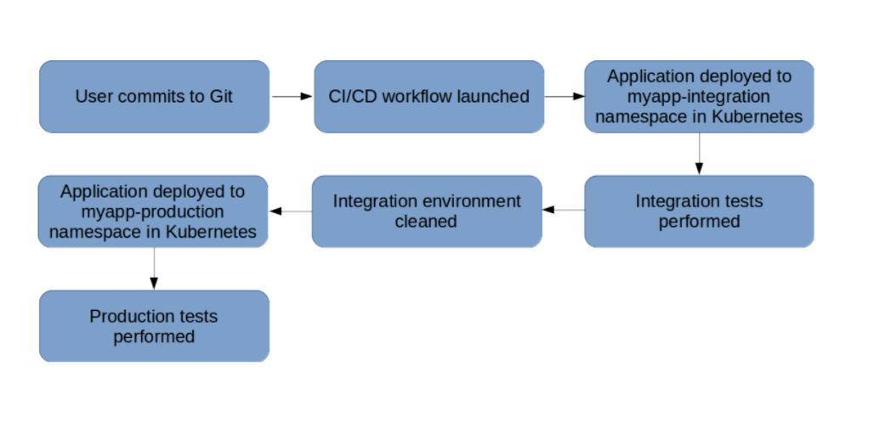

# How to setup CI/CD workflow for Node.js apps with Jenkins and Kubernetes

### Introduction

DevOps filozofisini sekillendiren pratiklerden ikisi CI/CD, Continuous Integration and Continuous Delivery yani surekli entegrasyon ve surekli dagitimdir. Basitce, bu olgu icinde uygulamali urun gelisimi ve entegrasyonu barindirir, ana repository'de surekli commit edilerek fonksiyonlarin calisip calismadigi test edilip, urunu deploy etmeye hazir hale getirir.

Bu is akisi ve calisma dongusu otomasyon mugendisligini kullanir. Bu yazi dizininde ise CI/CD calisma methodunu aciklayip, bir Node.js uygulamasini Kubernetes'de host edip inceleyecegiz. Otomasyon kismi icin Jenkins kullanacagiz.

Bu dizin icin Kubernetes cluster'i kurulmus ve Helm/Tiller server yuklenmis olmalidir. Bunun yani sira, Git ile ilgili bilgi sahibi olmak ve repository'ye sahip olmak da gerekmektedir.


### Workflow and Architecture

Asagida gosterilen is ilerleyisini takip edecegiz:




Farkedilecegi uzere Kubernetes namespacase'leri deployment environment yani yukleme sahasi olarak kullanacagiz.

Bunun icin namespacase'leri olusturmamiz gerekiyor:

```
$ kubectl create namespace myapp-integration

    namespace/myapp-integration created

```

```
$ kubectl create namespace myapp-production

    namespace/myapp-production created

```

Namespacase'lerin olusturulup olusturulmadigini kontol etmek icin:


```
$ kubectl get namespaces

NAME                   STATUS   AGE
default                Active   11d
kube-public            Active   11d
kube-system            Active   11d
kubernetes-dashboard   Active   11d
myapp-integration      Active   2m7s
myapp-production       Active   106s

```
